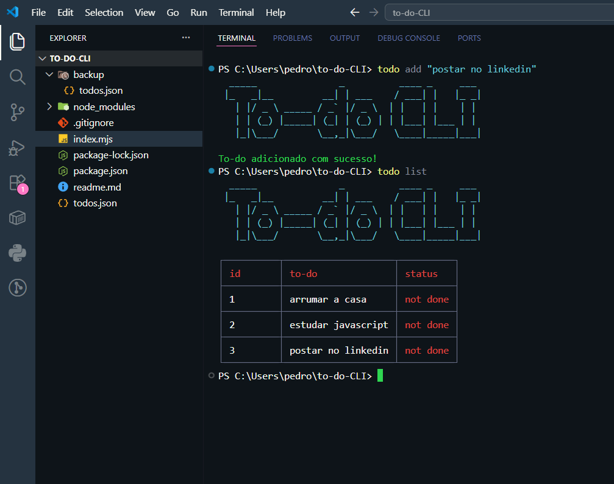

# CLI que registra to-do em um arquivo json
Um sistema desenvolvido para fins didáticos, no qual ao envia uma tarefa ```node todo add [task]``` ele salva em um arquivo chamado *todos.json* e caso você queira mostrar todos as to-dos basta inputar o comando ```node todo list``` e aparecerá todas organizadas em uma tabela, sendo possível identificar quais foram feitas e quais não.

# Funcionalidades

O Projeto conta com funcionalidade como: 
- **Criar uma to-do**: ```node todo add```
- **Marcar uma to-do como feito**: ```node todo do [id]```
- **Desmarcar uma to-do como não feita**: ```node todo undo [id]```
- **Fazer um backup do arquivo com as to-do**: ```node todo backup```
- **Restaurar as to-dos**: ```node todo restore```


## Depedências
- [chalk](https://www.npmjs.com/package/chalk) - ```npm install chalk```
- [cli-table](https://www.npmjs.com/package/cli-table)```npm install cli-table```
- [commander-js](https://www.npmjs.com/package/commander)```npm install commander```
- [figlet](https://www.npmjs.com/package/figlet)```npm install figlet```
- [inquirer](https://www.npmjs.com/package/inquirer)```npm install inquirer```
- [shelljs](https://www.npmjs.com/package/shelljs)```npm install shelljs```

## Observações

- **Também é possível executar os comandos no terminal sem usar "node todo list" apenas "todo list", basta digitar ```npm install -g```**

